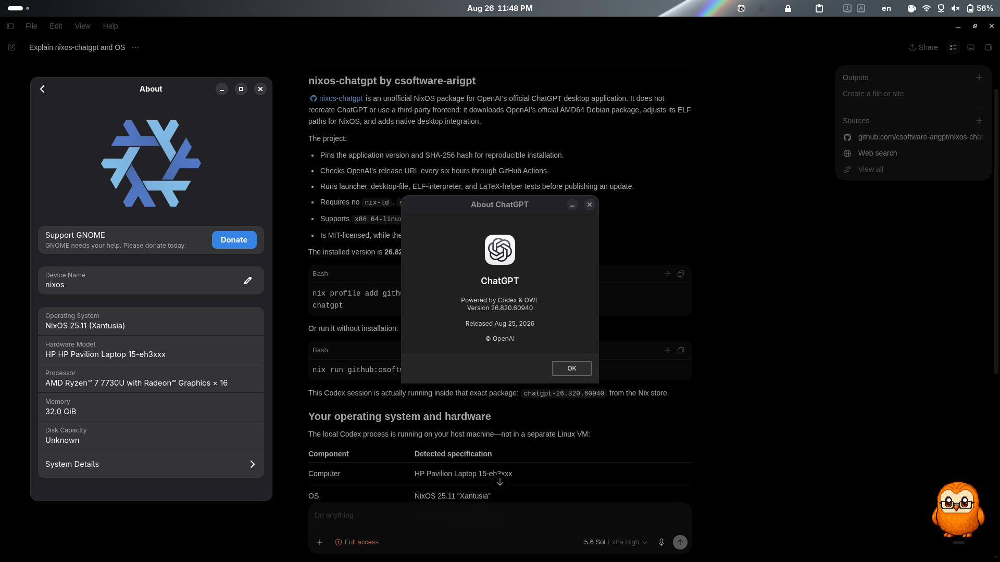

# ChatGPT for NixOS

An unofficial Nix package for the **official ChatGPT desktop application by
OpenAI**. The application is downloaded exclusively from OpenAI's official
[`oaistatic.com` download URL](https://persistent.oaistatic.com/codex-app-prod/linux/deb/latest/chatgpt_amd64.deb).



Current packaged version: `26.901.51231`.
Last package update: `2026-09-05T22:59:44Z`.

## Install and run with one command

```bash
nix profile add github:csoftware-arigpt/nixos-chatgpt && chatgpt
```

Run without installing it into your profile:

```bash
nix run github:csoftware-arigpt/nixos-chatgpt
```

Upgrade an existing profile installation:

```bash
nix profile upgrade nixos-chatgpt
```

### Recover from a hash mismatch

The official `latest` URL is mutable. If Nix reports a hash mismatch, do not
override the hash manually. Update from this repository after its pin changes:

```bash
git clone https://github.com/csoftware-arigpt/nixos-chatgpt.git
cd nixos-chatgpt
git pull --ff-only
nix flake check
nix profile upgrade nixos-chatgpt --refresh
```

If the profile still references an obsolete locked revision, replace it with
the verified local checkout:

```bash
nix profile remove nixos-chatgpt
nix profile add .#chatgpt
```

## Why use this repository?

- **Always current:** GitHub Actions checks OpenAI's official `latest` URL every
  hour.
- **Official application:** the main executable is taken directly from the
  official `.deb` without recompilation. Nix only fixes ELF paths and adds
  desktop integration. The one exception is the malformed bundled Tectonic
  helper, which is replaced with the same release from Nixpkgs so that LaTeX
  features work on a clean NixOS system.
- **Reproducible:** the exact version and SHA-256 are pinned in `sources.nix`, so
  the mutable `latest` URL cannot silently change an installation.
- **Verified before every update:** a new pin is published only after
  `nix flake check` passes its launcher, desktop file, ELF interpreter, and
  LaTeX helper smoke tests.
- **Native Nix package:** no `nix-ld`, `steam-run`, or FHS container is required.
- **Working external links:** Nix-specific library variables are removed before
  launching the system browser, and `codex://` callbacks are registered in the
  user's desktop MIME database.

## Supported platform

`x86_64-linux` is the only architecture provided by OpenAI's
`chatgpt_amd64.deb` package.

## How updates work

`nix develop -c ./scripts/update.sh` downloads the official package, validates
its Debian `Package`, `Architecture`, and `Version` fields, calculates its
SHA-256, and updates both `sources.nix` and the version shown in this README.
The `.github/workflows/update.yml` workflow runs every hour, synchronizes
the version in the GitHub repository description, and commits a new pin only
after a successful build. Description updates use the encrypted
`REPO_METADATA_TOKEN` Actions secret because GitHub's built-in workflow token
cannot write repository metadata.

> This repository is not affiliated with OpenAI. ChatGPT and the official
> binary package belong to OpenAI; this repository contains only the Nix
> packaging code.
